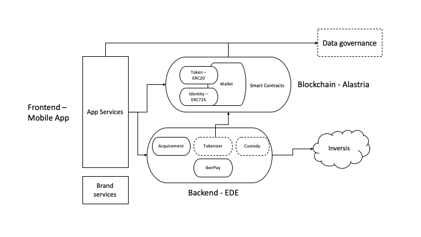

# IoBuilders POC

This document contains my thoughts and answers for the IoBuilders POC Challenge.

# 1.- Context

The main idea is to build a Tokenized Money Feature that allows users to convert a fiat currency into a token, and viceversa, on an easy and fast way.

The development of this feature might requires this parts:

- **Mobile App**. The final application build for Ios and Android that behaves as the end users wallet, and that contains all the necessary functions to operate with the wallet, create an identity, etc.

- **Tokenized money**. The virtual "representation" of the fiat. It`s the targeted resource that is going to live in the blockchain (one of Alastria´s chains). Smart Contracts based on the ERC20 token needs to be written to handle this functionality.

- **Identity**. The smart contract in charge of managing the creation and life of the digital identity within the blockchain (ERC725).

- **Wallet**. Smart contract(s) to handle customers operations on the blockchain (receive/transfer tokens, customer identity, balance, etc.).

- **Backend**. A backend that provides a layer of security for the operations and data of the system, manages the creation of logs and traces to monitor transactions, and allows connectivity with banking technologies.

# 2.- Exercice 1 - Thoughts, ideas about tech and architecture with this context.

Going in deep into those parts:

## Mobile App

As seen, this is the application the end user will have at their disposal for interacting with their wallet. It will be an IOS and Android application.

In order to increase development speed, it can maybe be a good idea to explore other possibilities as Web applications:

- IOS/Android app
    + Better results regarding app GUI.
    + As it would be native apps, we have os features available to increase UX.

    - Two applications needs to be developed (xamarin can ease this point).
    - The more systems to be built, the more maintenance will be needed.

- Web app
    + Only one app to build.
    + Can maybe be built faster (has fast results, minimum viable product or MVP).
    - Worse UX.

> Talk about choices.

Regarding the technologies and architecture, two differents approachs are needed:

1. Native App

    Once the app is built (Kotlin/Java or Swift) it would be ready to be used by any user. **Android Studio** is the best choice for Android while **Xcode** looks the most used IDE for IOS apps (needs apple device for developing). As a third alternative, **Xamarin** can feet best for this kind of scene.

2. Web App

    There are many frameworks to choose from to build this kind of application. **React**, **Vuejs** and **Angular** are the most used and valued in the current GUI development scene rigth now.
    This kind of applications implies, in addition to the development itself, its **hosting** on a web server. Hosting it in the cloud can probably be the best choice (AWS, Azure or Google Cloud).

> Moreover of all mentioned, connectivity with the Blockchain (web3js) where the smart contracts will be deployed and our Backend (Rest services) is needed to be taken into account.

## Backend

The backend would be in charge of carrying out most of the banking-related operations, as well as handling connectivity with the related banking technologies (EDE). This component would be splitted into microservices based on its responsibilities and roles (maintenance or failure of one of its services does not imply that we stop providing the others).

This part can be developed using **Java** and **Spring boot**:

- **Data Management** — Spring JDBC, Spring JPA, Spring MongoDB , Spring Apache Cassandra.
- **Integration** — Spring provide abstraction to integrate with Apache Kafka, any AMQP, RabbitMQ, ActiveMQ, Grafana...
- **Cloud Native Support** — Easy to deploy on Docker, Kubernetes, etc.
- **Security** — Spring Security (OAuth2 and Session management).
- **Testing** — Spring Testing module, Mocking, Profiling.

> There is a Java implementation of web3js library so that comunication with blockchain wouldn´t be a problem.

This service could be deployed in the cloud in our own cluster (Kubernetes) or by a cloud service provider like AWS, GC or Azure.

## Smart contracts

This part includes both the contracts to cover the functionality of the token as well as the Self Sovereign Identity. 

- Being a EVM based Blockchain implies these programs must be written in Solidity.
- Solidity Development Patterns must be applied in order to increase security, save gas and ease mantainance (Proxy, Eternal Storage, Secure Ether Transfer...).
- Truffle Suite (Truffle and Ganache) or Remix IDE for smart contracts development and testing. GEth can be a good choice too in order to have a local Ethereum node for testing.
- Smart contracts deployment one of the testnets available (Ropsten, Rinkeby) once all the system is almost ready.
- ERC20 and ERC725 are open source standards so the is no need to reinvent the wheel.

> What about ERC 223? Avoiding tokens to be burnt.

As seen, the architecture for this programs to be deployed on is already available. The selected blockchain itself is the medium where the contracts will be accessible and all interactions with them will be recorded. As marked in the main image, the selected chain would be one of Alastria´s available blockchains: **Net T**, built with Quorum, or **Net B**, built with Hyperledger Besu.

> What about the new Alastria´s implementation for Self Sovereign indentity? (Net H+)

# 3.- Exercice 2 - Team

Given the importance of this project and the estimated development time, a good investment and management of resources is important: providing sufficient and quality resources (speaking in terms of human capital, in this case), in addition to making them work. in an efficient and productive way is key. 

In my opinion, based on the technological aspects discussed above, the team should count with the following skills:

- Seniority on mobile apps development. Android and IOS knowledge is important, as well as good skills on User Experience (this requirement depends on the Frontend solution selected).
- Experience on backend development with Java and Spring boot. 
- Smart Contracts development knowledge, as well as of Ethereum and blockchain features.
- Security knowledge in order to shield system communications and data.
- Abilities in unit testing.
- Knowledge about cloud services.
- Creativity and team working skills. Being collaborative and communicative with the team is key.
- Interest in continue learning and grow as developers.

Given those skills, my proposal for the roles and team size is:

- **Proyect leader** - An expert in the project's ambit and team management. Someone with deep Software development and blockchain knowledge.

- Two **Team leaders** - Senior developers in which to delegate management tasks.

- Six or seven **Developers** - Frontend/Backend developers and UX designers.

# 4.- Exercice 3 - Culture

As mentioned above, collaboration and communication are important components in project solving. Everybody in the team has to work in the same direction, sharing their thinking and ideas in order to improve the product and make it grow.
The application of agile methodologies such as Scrum together with tools that ease the assignment and management of tasks such as Jira or Trello, perfectly fit the described scenario, in addition to Git for version control and code upload.

An open source culture among the team is also important, above all for the smart contracts developers: there is no need to be afraid of sharing with the world our blockchain solutions for the problems we face.

> The nature of the Blockchain makes it possible that making smart contracts public does not imply a security breach in our system.